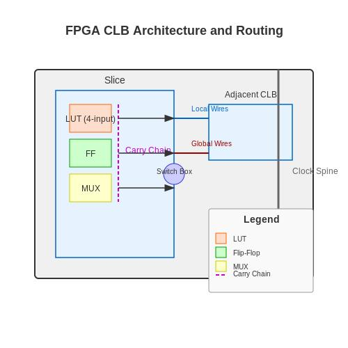
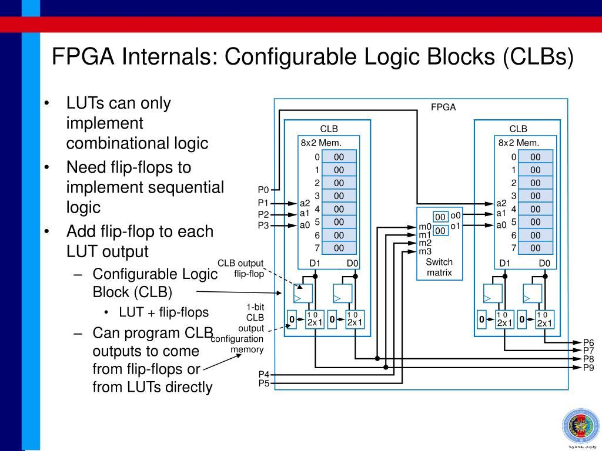

# FPGA ( Field Programmable Gate Array )

An **FPGA (Field-Programmable Gate Array)** is a type of digital electronic device that can be **programmed to behave like custom hardware**.

> **A chip made of many configurable digital circuits that you can connect and configure to perform your own hardware design.**

### What is inside an FPGA?

A typical FPGA contains:

* **Logic blocks (LUTs)** → implement AND, OR, XOR, multiplexers, etc.
* **Flip-flops** → store digital states/bits
* **Programmable interconnects** → connect the logic blocks in different ways
* **I/O blocks** → communicate with external devices
* **Block RAM** → high-speed internal memory
* **DSP blocks** → fast multiplication, filtering, signal processing
* **Clock-management circuits** → PLL/MMCM, etc.




### Why is FPGA used in electronics?

The biggest reason is **hardware flexibility + parallel processing**.

For example, suppose you need a circuit that performs:

```text
Sensor
  ↓
ADC
  ↓
FPGA
  ├── Filter signal
  ├── Calculate values
  ├── Detect faults
  ├── Control motor
  └── Send data to PC
```

You can implement all of these functions **inside the FPGA hardware**.

Unlike a normal processor that generally executes instructions sequentially, an FPGA can have multiple hardware operations running **at the same time**.

### FPGA vs Microcontroller

| Feature             | Microcontroller        | FPGA                                   |
| ------------------- | ---------------------- | -------------------------------------- |
| Programming         | C/C++ typically        | Verilog/VHDL/SystemVerilog             |
| Architecture        | Fixed CPU architecture | You configure hardware                 |
| Parallel processing | Limited                | Excellent                              |
| Timing control      | Good                   | Extremely precise                      |
| Flexibility         | Software-level         | Hardware-level                         |
| Development         | Usually easier         | More complex                           |
| Typical use         | Sensors, control, IoT  | High-speed processing, custom hardware |

For example, with a microcontroller:

```text
Read Sensor
     ↓
Process
     ↓
Read another sensor
     ↓
Process
     ↓
Send data
```

With an FPGA you could build:

```text
Sensor A ──→ Processing A ──┐
Sensor B ──→ Processing B ──┤
Sensor C ──→ Processing C ──┤──→ Output
Sensor D ──→ Processing D ──┘
```

These processing paths can operate **in parallel**.

---

## Where are FPGAs used?

### 1. Telecommunications

FPGAs are used for high-speed data processing such as:

* 5G/4G infrastructure
* Network equipment
* Packet processing
* Signal processing

### 2. Image and video processing

For example:

```text
Camera
  ↓
FPGA
  ↓
Image processing
  ↓
Display / AI processor
```

They can perform operations on many pixels simultaneously.

### 3. Industrial automation

This is particularly relevant to your engineering background.

An FPGA can interface with:

```text
Sensors
   ↓
FPGA
   ↓
Control logic
   ↓
Motor / actuator
```

It can also handle high-speed encoder signals, precise timing, machine control, and custom interfaces.

### 4. Automotive

FPGAs can be used for:

* ADAS
* Radar processing
* Camera systems
* Sensor fusion
* Automotive networking

### 5. Aerospace and defense

FPGAs are useful where deterministic, high-speed processing and specialized hardware are required.

### 6. Testing equipment

FPGAs are commonly used in:

* Automated test equipment
* Oscilloscopes
* Logic analyzers
* Semiconductor testers
* High-speed data acquisition

---

## FPGA vs PLC

A PLC might do:

```text
Input → PLC CPU → Program → Output
```

An FPGA can essentially let you create the underlying digital hardware:

```text
Input
 ↓
Custom FPGA logic
 ├── Counter
 ├── Timer
 ├── PWM
 ├── State machine
 ├── Communication
 └── Signal processing
 ↓
Output
```

A PLC is generally much easier to program for industrial control.

An FPGA becomes attractive when you need **very high speed, precise timing, large numbers of simultaneous operations, or specialized digital hardware**.

---

## How do you program an FPGA?

You don't normally program it like Python or C.

You can use **HDLs (Hardware Description Languages)** such as:

* **Verilog**
* **SystemVerilog**
* **VHDL**

For example, conceptually:

```verilog
assign output = input_a & input_b;
```

This doesn't mean:

> "Execute an AND instruction."

Instead, the FPGA is configured so that its hardware **implements an AND operation**.

That's the important difference.

### A simple way to remember it

**CPU:**

> "Tell the hardware what to do."

**FPGA:**

> "Configure the hardware to become the circuit you need."


